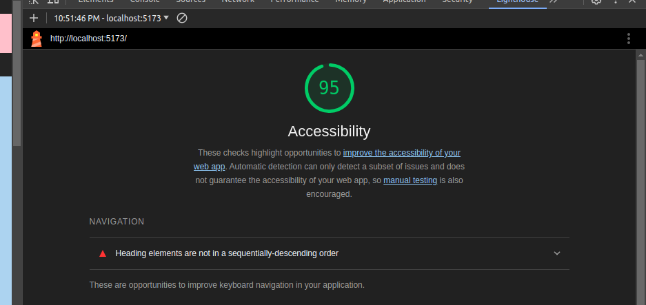

# Gallery of Horns

## Lighthouse

## Task

1. Using the Form component of react-bootstrap, build a drop down menu so that the user can choose to filter by number of horns.
2. When the user chooses one of the options, the correct images should be displayed.

## Feature #1: Filter by Numbers of Horns

**Estimated time needed to complete**: *30 minutes*

**Start time**: *1800*

**Finish time**: *1830*

**Actual time needed to complete**: *30 minutes*

> All times are in EST
